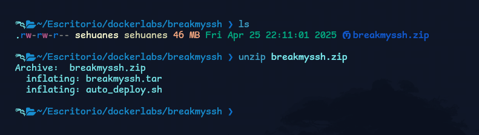

# BreakMySSH (DockerLabs)

**Plataforma:** DockerLabs  
**Dificultad:** Muy fácil  
**Objetivo:** Acceso inicial + root  
**Skills:** Recon, Enumeration, SSH, Privilege Escalation

---

## 🧭 Resumen (Summary)
En esta máquina realicé reconocimiento del servicio SSH, obtuve acceso inicial y luego realicé escalada de privilegios hasta root.

---

### Descomprimir el laboratorio

´´´bash
unzip breakmyssh.zip
´´´

