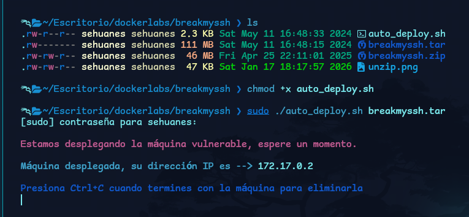

# BreakMySSH (DockerLabs)

**Plataforma:** DockerLabs  
**Dificultad:** Muy fácil  
**Objetivo:** Acceso inicial + root  
**Skills:** Recon, Enumeration, SSH, Privilege Escalation

---

## 🧭 Resumen (Summary)
En esta máquina realicé reconocimiento del servicio SSH, obtuve acceso inicial y luego realicé escalada de privilegios hasta root.

---

### Descomprimir el laboratorio

Una vez descargado el archivo .zip de la plataforma, procedemos a descomprimir su contenido con el comando:

 ```bash
unzip breakmyssh.zip
```


### Despliegue de la maquina
Vemos que nos dan 3 archivos, lo siguiente que debemos hacer es darle permisos de ejecución al archivo llamado auto_deploy.sh, luego ejecutarlo pasandole el archivo .tar que nos brindaron al descomprimir, que en este caso, es el nombre de la maquina, vemos que la maquina se desplegará y los darán la IP objetivo.
```bash
chmod +x auto_deploy.sh
sudo ./auto_deploy.sh breakmyssh.tar
```


